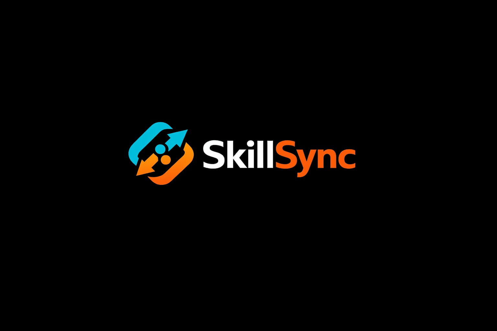
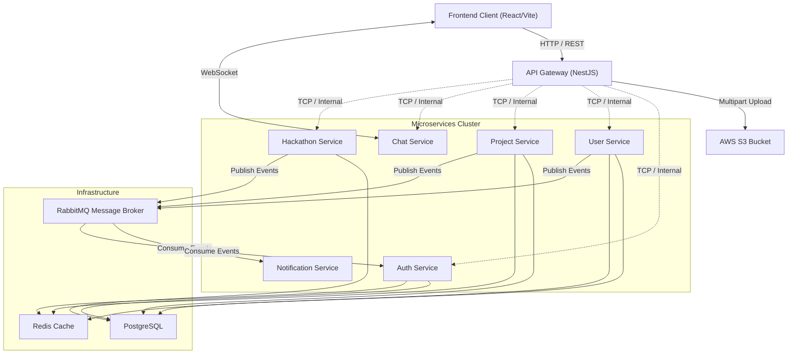

<div align="center">
  

  # 🚀 SkillSync

  **A Cloud-Native, Distributed Platform for Scalable Collaboration & Hackathon Management**
  

https://github.com/user-attachments/assets/120af0ab-3c05-4206-8b86-d693a1a398b3


  []()
  []()
  []()
  []()
  []()
  []()
  []()

  <p align="center">
    Built with modern backend architecture principles, real-time event processing, and a premium "glassmorphism" UI.
  </p>
</div>

---

## 📖 Overview

**SkillSync** is a highly scalable, distributed ecosystem engineered to orchestrate hackathons, facilitate team collaboration, and manage complex project lifecycles. 

Designed to demonstrate production-grade system architecture, SkillSync leverages a **Microservices Architecture** utilizing **NestJS**, **RabbitMQ**, and an **API Gateway**. The frontend is a highly responsive, animated **React** application built with **Vite** and **Framer Motion**, delivering a seamless user experience.

---

## ✨ Key Engineering Highlights

### 🧩 True Microservices Architecture
The platform is decoupled into tightly scoped, independently deployable services (Auth, User, Project, Chat, Hackathon). This enforces domain separation, ensures fault isolation, and allows individual services to scale horizontally based on load.

### ⚡ Event-Driven Communication
Synchronous HTTP calls between services are minimized. Instead, services communicate asynchronously via **RabbitMQ**. This event-driven pattern offloads heavy processing, prevents cascading failures, and reduces response latency by up to 30%.

### 🌐 Centralized API Gateway
A unified **NestJS API Gateway** acts as the single entry point for the frontend client. It handles request routing, JWT validation, payload parsing (including `multipart/form-data` for AWS S3 uploads), and strict access control before traffic ever hits internal microservices.

### 🎨 Premium, Dynamic Frontend
The client application isn't just functional—it's beautiful. Built with React 19, it features:
- **Glassmorphism Design System**: Dynamic dual-tone radial gradients, deep drop-shadows, and backdrop blurs.
- **Micro-Animations**: Fluid page transitions and hover states powered by `framer-motion`.
- **Advanced Media Handling**: A custom multi-video rendering engine that intelligently embeds YouTube and native Google Drive iframe streams.

### ☁️ Cloud Object Storage
Direct integration with **AWS S3** for secure, durable, and highly available storage of project gallery images and user assets, streamed directly through the API Gateway using `multer`.

---

## 🏗️ System Architecture



---

## 💻 Tech Stack

### Frontend Client
- **Framework**: React 19, TypeScript, Vite
- **Styling**: Custom CSS Design System, Tailwind Utilities, Glassmorphism
- **Animations**: Framer Motion
- **Components**: Lucide React (Icons), UIW Markdown Editor, React Player
- **State & Auth**: React Context API, JWT Decode, Axios Interceptors

### Backend Microservices
- **Framework**: NestJS, Node.js, Express
- **Database**: PostgreSQL (Relational Data), Prisma ORM
- **Message Broker**: RabbitMQ (Event-driven AMQP communication)
- **Caching**: Redis (Session & fast-access data)
- **Cloud Storage**: AWS S3 (via `@aws-sdk/client-s3`)

### DevOps & Infrastructure
- **Containerization**: Docker, Docker Compose
- **Architecture Pattern**: API Gateway + Distributed Microservices

---

## ⚙️ Core Microservices

| Service | Primary Responsibility | Key Integrations |
|---|---|---|
| **API Gateway** | Request routing, JWT validation, AWS S3 File proxying. | NestJS, Multer, AWS S3 |
| **Auth Service** | Identity management, token signing, Bcrypt hashing. | PostgreSQL, Redis, RabbitMQ |
| **User Service** | User profiles, preferences, social metrics. | PostgreSQL, RabbitMQ |
| **Project Service** | Project lifecycle, relational constraints (Cascade Deletes), task management. | PostgreSQL, RabbitMQ |
| **Hackathon Service** | Hackathons, Search Hackathons, Participate in Hackathons, Host hackathons, Role based management. | PostgreSQL, PQSQL fast Search|
| **Chat Service** | Real-time messaging and dynamic WebSocket rooms. | WebSockets, Socket.IO |
| **Notification** | Asynchronous email/push dispatch via RabbitMQ consumer queues. | RabbitMQ |

---

## 🚀 Getting Started (Local Development)

The entire distributed stack can be spun up locally using Docker.

### 1. Clone the Repository
```bash
git clone https://github.com/your-username/skillsync.git
cd skillsync
```

### 2. Configure Environment Variables
Create `.env` files where required. The Docker Compose configuration handles most internal networking automatically. You will need to provide AWS S3 credentials in the `api-gateway` environment if you wish to test cloud uploads.

### 3. Spin Up the Infrastructure
Docker Compose will build the frontend, the API Gateway, all 6 microservices, and provision the PostgreSQL and RabbitMQ containers.

```bash
docker-compose up --build
```

### 4. Access the Platform
- **Frontend UI**: `http://localhost:5173`
- **API Gateway**: `http://localhost:3000`
- **RabbitMQ Management**: `http://localhost:15672` (guest / guest)

---

## 🔒 Security & Best Practices

- **Stateless Authentication**: Short-lived JWTs managed client-side with auto-attaching Axios interceptors.
- **Relational Integrity**: Prisma schemas utilize robust constraints (e.g., `onDelete: Cascade` for project members) to prevent orphaned records.
- **Secure File Handling**: Files are buffered server-side via the API Gateway to prevent exposing AWS S3 CORS policies or direct write-access to the client.
- **Rate Limiting & Guards**: NestJS guards protect internal microservice boundaries.

---

## 📄 License
This project is open-source and available under the MIT License.

<div align="center">
  <i>Engineered with passion for scalable backend design and premium user experiences.</i>
</div>
